## Laravel - Hubspot

[](https://packagist.org/packages/agenciafmd/laravel-hubspot)
[](LICENSE.md)

- Envia as conversões para o Hubspot

## Instalação

```bash
composer require agenciafmd/laravel-hubspot:dev-master
```

Antes de começarmos, é preciso solicitar uma conta para termos acesso ao Hubspot como desenvolvedor.
 
Isso caso o ‘Marketing’ responsável pela integração não tenha criado o formulario lá ainda, ***caso*** ele já tenha 
criado, peça o `Código de incorporação` do formulário, e pule para esse passo [Codigo de incorporação](#codigo--de--incoporação) 
e depois pule para adicionar os valores no .env, se não, continue na Documentação.

Bom, vamos começar.
# Acessando o Hubspot
## Configuração do formulário

O nosso objetivo inicial é criar um formulário para capturar os leads do site e enviar para o Hubspot.

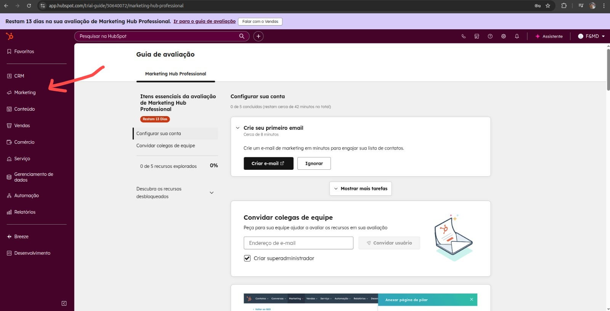
____
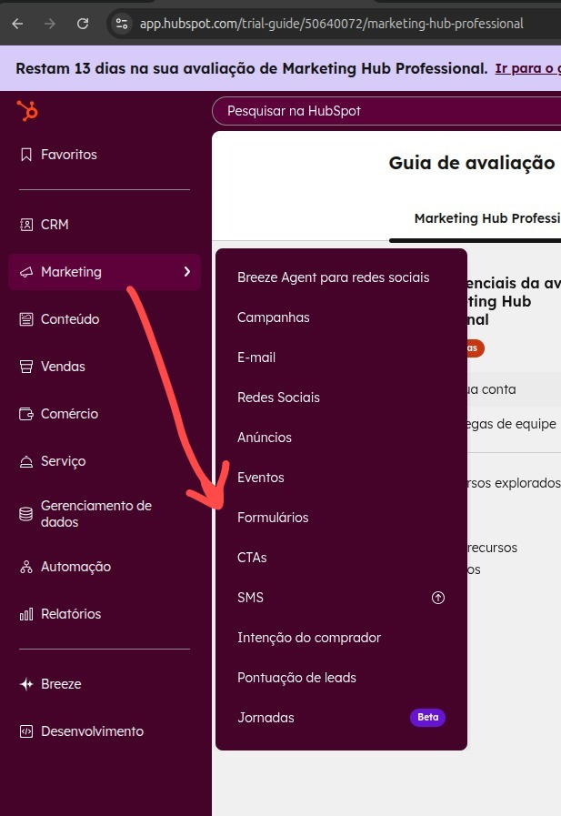
____
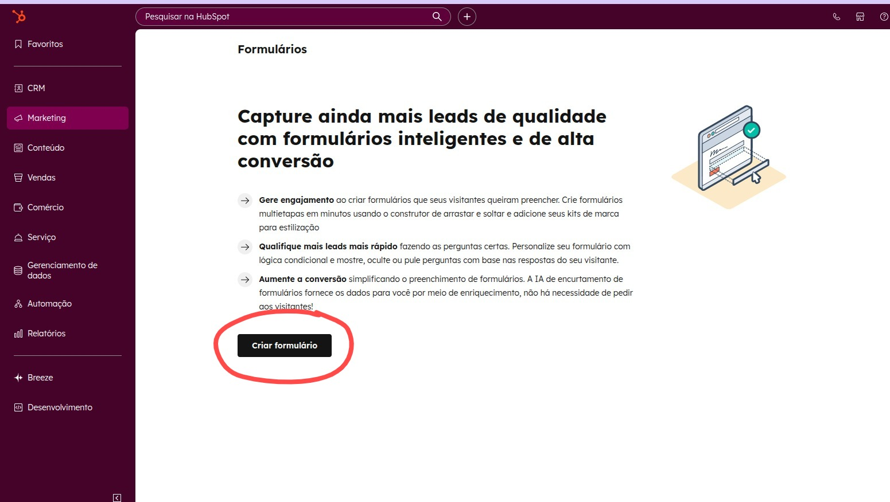
____
### Criar formulário
Agora vamos criar o formulário que iremos utilizar para capturar os leads, 

#### Por exemplo 
seguindo os padrões que temos de LP que é {nome, email, telefone}, mas claro que se o form que você estiver codando 
tenha mais campos, adicione os campos necessários.

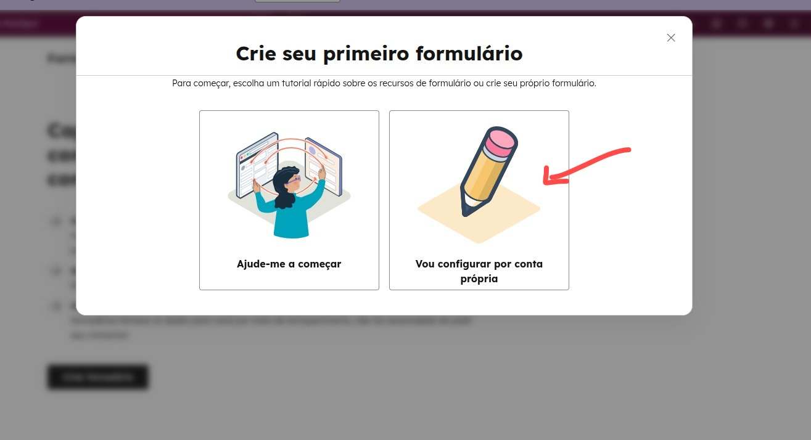
____
### Adicionar campos
Agora vamos começar a Personalizar o formulário, adicionando os campos necessários para nosso projeto.

Neste caso dos prints, o projeto precisava apenas de nome, email e telefone, então já comecei removando o campo de
"Last name" que vem por padrão.

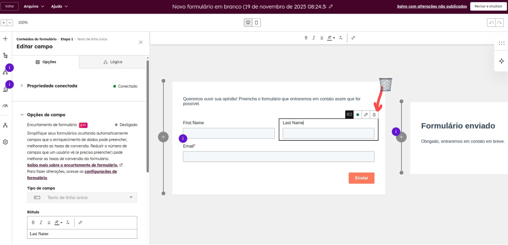

E logo após, adicionei o campo de telefone que faltava.

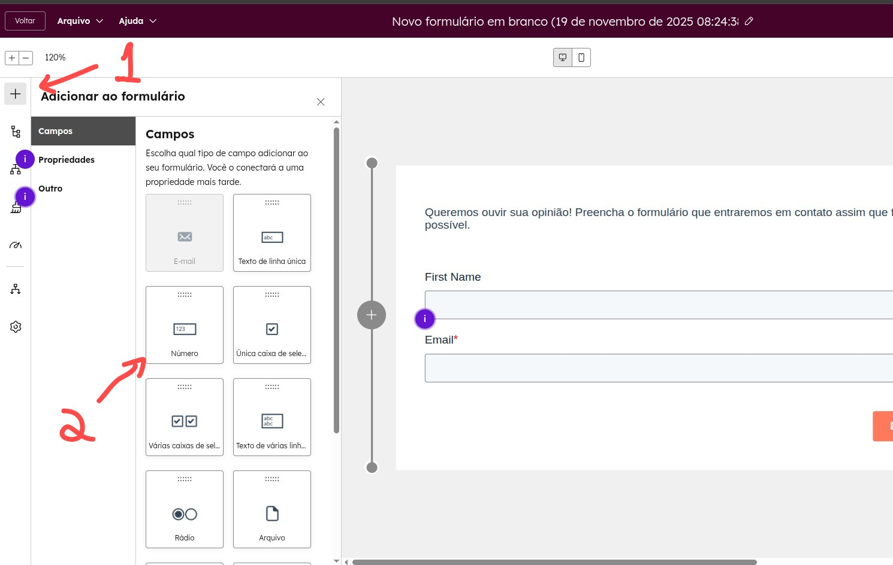

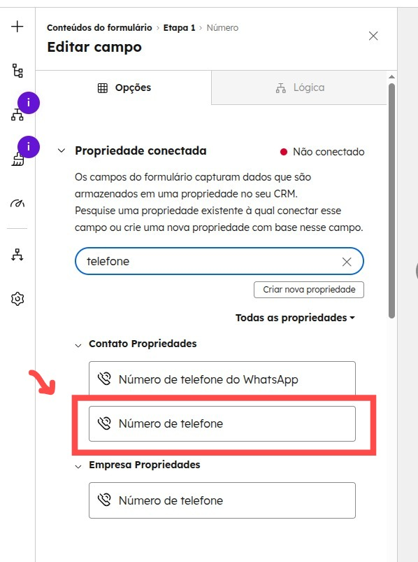

Após adicionar os campos necessários, basta salvar o formulário clicando em "Revisar e Atualizar" .
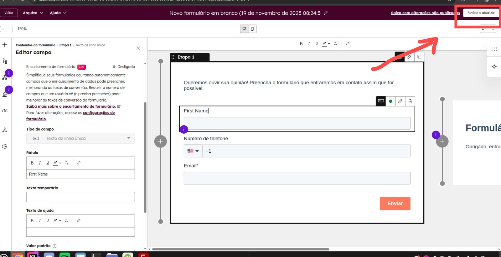

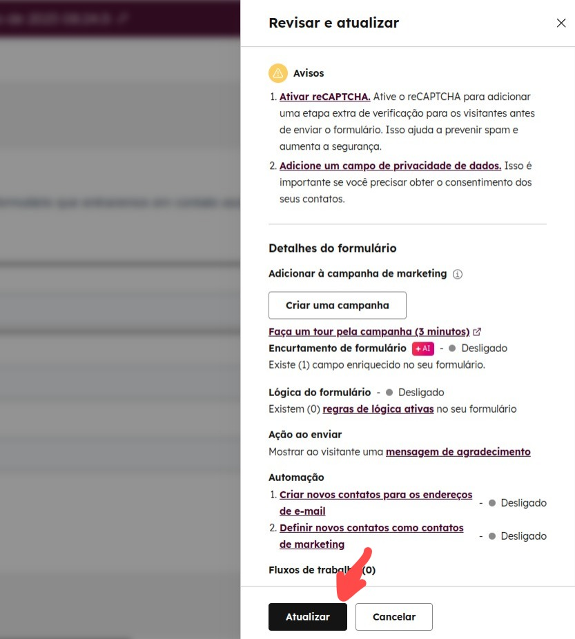
____
### Codigo de incorporação
Pegue o código de incorporação do formulário no Hubspot para termos o valor de `portalId` e `formId`.

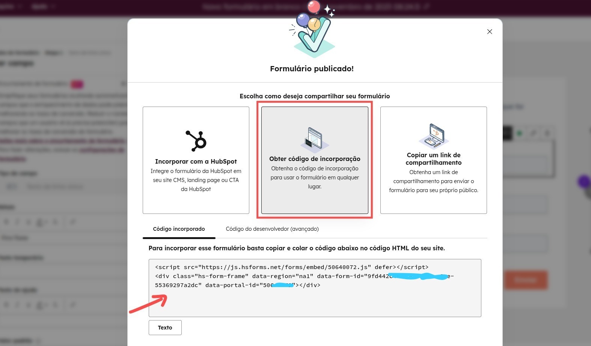

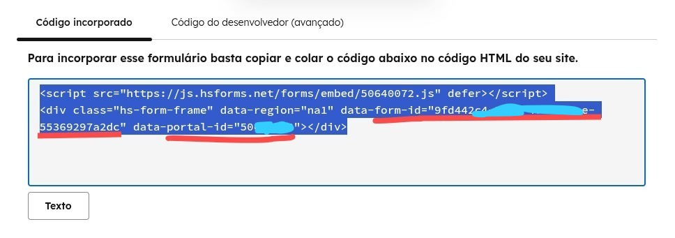

Agora com os valores em mãos, vamos seguir para implementação no projeto.
____
## Uso
____
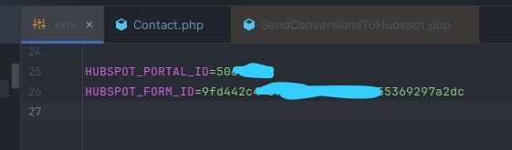

Dentro do nosso projeto Laravel, vamos adicionar os valores no arquivo `.env`:
```
HUBSPOT_PORTAL_ID=
HUBSPOT_FORM_ID=
```
Por exemplo:

```env
HUBSPOT_PORTAL_ID=50XXXXX
HUBSPOT_FORM_ID=9fd442c4-XXXX-XXXX-XXXX-55369297a2dc
```

e no terminal rode o comando:

```bash
 php artisan queue:listen --queue=low
```

Agora para implemetar no nosso Submit do livewire, seguimos o exemplo abaixo:

```php
use Agenciafmd\Hubspot\Jobs\SendConversionsToHubspot;

...
        $payload = [
            'fields' => [
                ['name' => 'firstname', 'value' => $data['name']],
                ['name' => 'email', 'value' => $data['email']],
                ['name' => 'phone', 'value' => '+55' . preg_replace('/\D/', '', $data['phone'])],
            ],
            'context' => [
                'pageUri' => request()->url(),
                'pageName' => 'Contato - ' . config('app.name'),
            ],
        ];

        SendConversionsToHubspot::dispatch($payload)
            ->delay(5)
            ->onQueue('low');
...
```

Feito isso, agora é só testar o formulário e verificar nos `Storage/Logs/hubspot-20YY-MM-DD.log` se foi registrado.

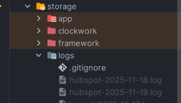

E verificar com o Marketing se o lead chegou no Hubspot.


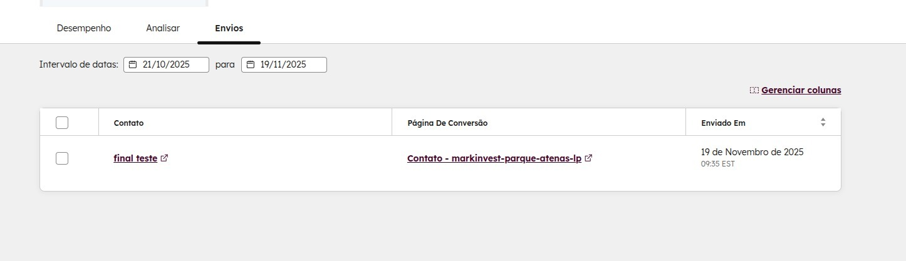

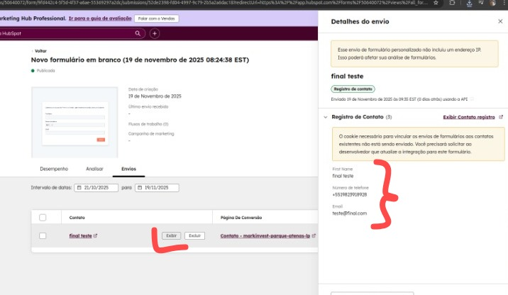

---